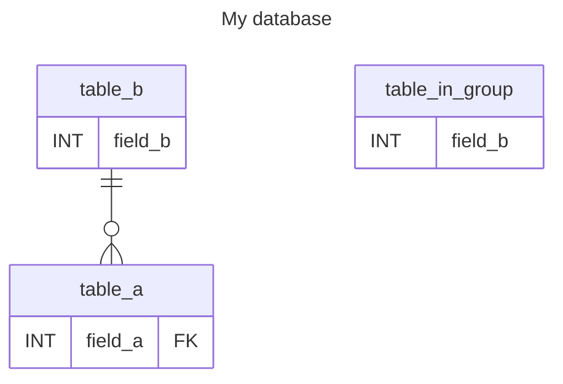
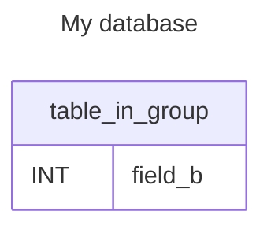
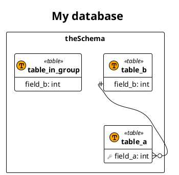

# Demo of Provenance

## ER diagram

This will we overriden when generating documentation using the Maven task.

```shell
mvn provenance:generate
```

### Mermaid
[//]: #MODEL_MERMAID_PLACEHOLDER_START ()

[//]: #MODEL_MERMAID_PLACEHOLDER_END ()

#### Only a specific group
[//]: #MODEL_MERMAID_GROUP_PLACEHOLDER_START ()

[//]: #MODEL_MERMAID_GROUP_PLACEHOLDER_END ()

### Plantuml
[//]: #MODEL_PLANTUML_PLACEHOLDER_START ()

[//]: #MODEL_PLANTUML_PLACEHOLDER_END ()
