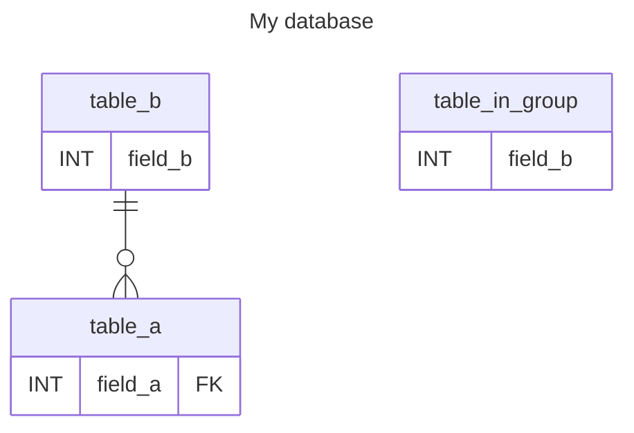

# Demo of Data Dictionary

Generates a data dictionary and places it in the `generated` folder.
Furthermore, will the table in [Data Dictionary that will be rewritten](#data-dictionary-that-will-be-rewritten) will we updated when generating provenance.  

```shell
mvn provenance:generate
```

### Mermaid E/R diagram that will be rewritten
[//]: #MODEL_MERMAID_PLACEHOLDER_START ()

[//]: #MODEL_MERMAID_PLACEHOLDER_END ()

### Data Dictionary that will be rewritten

[//]: #DATA_DICTIONARY_START ()
| Filename            | Column            | Position | Type         | Mandatory | Keys | Description                             | Example |
|---------------------|-------------------|---------:|--------------|:---------:|------|-----------------------------------------|--------:|
| some_file.csv       | some_column       | 1        | varchar(200) | Yes       |      |                                         |         |
| some_file.csv       | some_other_column | 2        | date         | No        |      | some description<br>with multiple lines | xyz     |
| some_other_file.csv | some_column       | 1        | number       | No        |      |                                         |         |
[//]: #DATA_DICTIONARY_END ()
